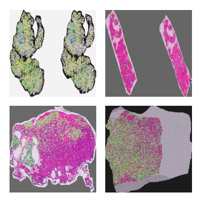
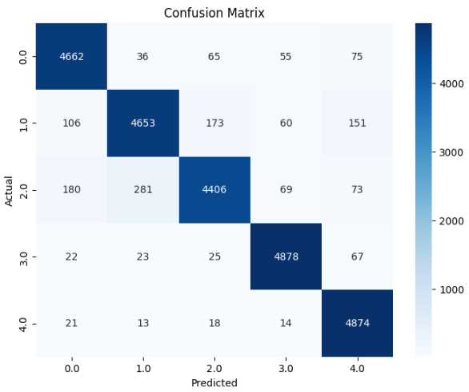
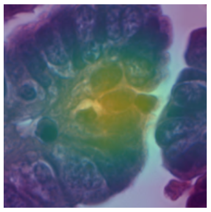
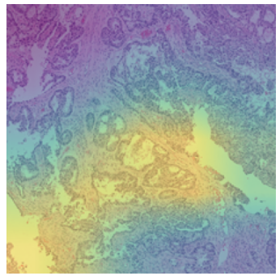

# Ovarian-Cancer-Subtypes-Classification-XAI-Implementation
# 🧬 Ovarian Cancer Subtype Classification

This project focuses on classifying ovarian cancer into five distinct subtypes: **CC**, **EC**, **HGSC**, **LGSC**, and **MC**, using deep learning and oversampling techniques to address class imbalance. Achieving a **93.89% accuracy**, this project highlights the potential of AI in advancing cancer research. 

---

## 📂 Dataset Information

### Original Class Distribution:
| Class | Subtype | Samples |
|-------|---------|---------|
| 0.0   | CC      | 5579    |
| 1.0   | EC      | 7433    |
| 2.0   | HGSC    | 12028   |
| 3.0   | LGSC    | 2908    |
| 4.0   | MC      | 3276    |

The dataset exhibits a severe class imbalance, making it challenging for traditional models to achieve robust performance.

### Oversampling with Manual SMOTE:
To balance the dataset, **SMOTE (Synthetic Minority Oversampling Technique)** was applied, resulting in equal distribution across all classes:

| Class | Subtype | Samples |
|-------|---------|---------|
| 0.0   | CC      | 25000   |
| 1.0   | EC      | 25000   |
| 2.0   | HGSC    | 25000   |
| 3.0   | LGSC    | 25000   |
| 4.0   | MC      | 25000   |

---

## 🛠️ Methodology

### 1️⃣ **Feature Extraction**
- **Pretrained Model**: We used **ResNet50** to extract features from the ovarian cancer dataset.

### 2️⃣ **Oversampling**
- Applied **SMOTE** on the extracted features to handle class imbalance.

### 3️⃣ **Model Training**
- A **custom deep learning model** was designed and trained on the oversampled features.

### 4️⃣ **Evaluation**
- Achieved an impressive **accuracy of 93.89%** on the test dataset.

---

## 📊 Results

### Performance Metrics:
| Metric       | Value     |
|--------------|-----------|
| **Accuracy** | 93.89%    |
| **Precision**| High      |
| **Recall**   | High      |
| **F1-Score** | High      |

### Confusion Matrix:
The confusion matrix shows robust classification across all five classes. 

---

## 📷 Visualizations

### 1️⃣ Example Cancer Images:



---

## 🚀 How to Run

### 1️⃣ Clone the Repository
```bash
$ git clone Ovarian-Cancer-Subtypes-Classification-XAI-Implementation.git
$ cd Ovarian-Cancer-Subtypes-Classification-XAI-Implementation

```


---

## 🔑 Key Libraries

- **TensorFlow/Keras**
- **Scikit-learn**
- **SMOTE**
- **Pandas/Numpy**

---

## 📈 Results and Visualization

### 2️⃣ Confusion Matrix:


---
### 3️⃣ Explainable AI (XAI) Visualization:



---

## 🤝 Contributing

Contributions are welcome! Please feel free to submit a Pull Request or open an Issue.

---
